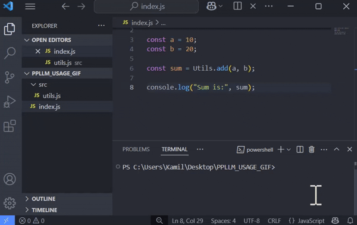
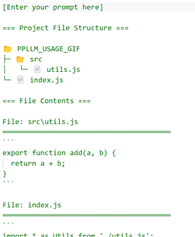

<table>
<tr>
<td>

</td>
<td>
<h2>ProjectPromptLLM</h1>
</td>
</tr>
</table>

  

Your assistant for generating prompts based on your project structure! 🚀  
Simple, convenient, customizable — just one command is enough to generate a clear prompt with the file tree and contents of your project.

<table>
<tr>
<td>

</td>
</tr>
</table>

To save the generated prompt to a file in your current directory, just run:
```bash
ppllm
```

The resulting prompt in the default file `ppllm.prompt.txt` will look like this:<br />
<table>
<tr>
<td>

</td>
</tr>
</table>


## 🌟 What is PPLLM?

**ProjectPromptLLM** (`ppllm`) is a CLI tool that creates a prompt based on the structure and contents of your project files. This prompt can then be used with ChatGPT or another LLM for research or development purposes. It supports presets of ignored files and folders, advanced configuration, and custom templates.

## 💾 Installation

Recommended installation with the `-g` flag for global access to the `ppllm` command without using `npx`:
```bash
npm install -g ppllm
```
or
```bash
npm install ppllm
```

## 🚀 Basic Usage

The simplest usage:
```bash
ppllm
```
After running this command, the current directory is scanned, and the prompt is saved to a file (default: `ppllm.prompt.txt`).

You might find that some unwanted files end up in the prompt, like those from `node_modules`, which can be very large and make the prompt impractical. To avoid this, run this command once:

```bash
ppllm -p nodejs
```

This way, you'll tell `ppllm` to use the built-in preset with ignored paths typical for a `node.js` project. The script will also save this decision to the configuration file (default: `ppllm.config.json`) in your current location, so next time you can simply use `ppllm` without additional parameters.

## 🧠 Advanced Usage

Interactive configuration wizard:
```bash
ppllm init
```

List available presets or view a selected one:
```bash
ppllm preset
ppllm preset python
```

Clone the default English template for generating prompts (`handlebars`) to your current location and set its filename as [name].prompt.hbs (`custom` if omitted):
```bash
ppllm template
ppllm template name
```

Check your current version of ppllm:
```bash
ppllm version
```

Help:
```bash
ppllm --help
ppllm preset --help
ppllm generate --help
```

## 🛠️ Configuration

Settings can be saved in a local file (default: `ppllm.config.json`).

The CLI automatically saves them after using the interactive wizard (`ppllm init`) or when specifying options during prompt generation, e.g.: `ppllm -p nodejs -b all`
In the config file, you'll also find a place for your own list of ignored files and folders `"ignore"` (use `glob` format), which will of course merge with the selected preset.

Example configuration file content:

```json
{
  "settings": {
    "template": "pl",
    "file": "ppllm.prompt.txt",
    "preset": ["general", "nodejs"],
    "maxSize": "10KB",
    "binary": "tree",
    "emoji": true
  },
  "ignore": [
    "TODO"
  ]
}
```

## 🧩 Templates

The prompt is generated based on a Handlebars template (`.hbs`). By default, the built-in English template `eng` is used, but other built-in templates are also available. You can also specify your own template by providing its full filename.

To use your own template, first clone the default English template:

```bash
ppllm template custom
```

Then specify its usage in the configuration or through CLI:

```bash
ppllm -t custom.prompt.hbs
```

To revert to one of the defaults, run one of the following commands:

```bash
ppllm -t eng
ppllm -t pl
```

## 🗂️ Presets

Presets are ready-made lists of files and folders to be skipped during prompt generation.  
The project includes built-in presets, general one and for popular technologies:

- `general`
- `nodejs`
- `python`

Presets **are not user-expandable**, but you can add your own ignore rules in the config file.

## 📝 Advanced Features

- Support for binary files in three modes: `tree`, `all`, `none`
- Limit file size (`--max-size`) for content loading
- Optional emojis in prompts 🎉

## 🎯 Usage Examples

Generate a prompt using the `general` and `nodejs` presets and emojis:

```bash
ppllm -p general nodejs -e
```

Use your custom template:

```bash
ppllm -t myTemplate.prompt.hbs
```

Export to a file with a custom name:

```bash
ppllm -f magic.prompt.txt
```

## ⚙️ CLI Options (saved to configuration)

| Flag                          | Description                                 | Default value |
| ----------------------------- | ------------------------------------------- | ------------- |
| `-d, --dir <dir>`              | Source project directory                    | `.`           |
| `-t, --template <template>`    | Handlebars template for prompt generation   | `eng`         |
| `-f, --file <filename>`        | Name of the output file                    | `ppllm.prompt.txt` |
| `-p, --preset <preset...>`     | Preset(s) of ignored files/folders         | []            |
| `-m, --max-size <size>`        | Max file size (e.g., 10MB, 5KB)            | `disable`     |
| `-b, --binary <mode>`          | Binary handling mode (`tree`, `all`, `none`) | `tree`        |
| `-e, --emoji`                  | Add emojis to prompts                      | `false`       |


## 🧭 Other CLI Options

| Flag                          | Description                                 | Default value |
| ----------------------------- | ------------------------------------------- | ------------- |
| `-o, --output <mode>`          | Output: `stdout` or `file`                  | `file`        |
| `-c, --config <filename>`      | Name of the config file                     | `ppllm.config.json` |

## ⚖️ License

ISC © [tonylus](https://github.com/TonylusMark1)
