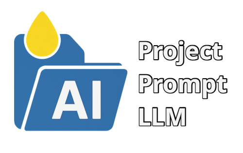

# PPLLM (ProjectPromptLLM)

**CLI tool to generate descriptive prompts from your project's file structure and contents.**

Just use `ppllm` command in your current working directory where your project is and magic happens. You'll find ready prompt in file called ppllm.prompt.txt (default) in same directory (default).

## ✨ Features
-----------------
- Tree visualization with emoji support 🌳
- Configurable ignored paths and custom prompts per folder
- Supports multiple languages
- Handles large and binary files gracefully
- Saves result to stdout or file

## 🚀 Installation and usage
-----------------
locally in your project
```bash
npm install ppllm --save-dev

npx ppllm
```
or globally
```bash
npm install -g ppllm

ppllm
```

### Options
-----------------
| Option              | Description                                                      |
|---------------------|------------------------------------------------------------------|
| `-d, --dir <dir>`   | Source directory to scan (default is current working directory)  |
| `-c, --config`      | Name of the config file (default: `ppllm.config.json`)           |
| `-s, --save`        | Save output to file (optionally pass filename)                   |
| `--no-config`       | Disable loading config files entirely                            |
| `-p, --preset <name>`  | Use ignore preset: `none` (default), `general`, or one of: `node`, `python`, etc. |
| `-l, --language`    | Language of messages: `eng` (default), `pl`, `es`, `fr`, `hu`, `cs`, `zh`, `ja` |
| `-m, --max-size <size>` | Max file size to include (e.g. `5MB`, `100KB`, or `0`/`false` to disable limit) |
| `-b, --binary <mode>` | Binary file mode: `none`, `tree` (default), or `all` *(see below)* |
| `-e, --emoji`       | Render emojis in prompt                                          |

### 🌐 Supported Languages
-----------------
Changing language affects generated prompt and all stdout messages.

The following language codes can be used with `--language`:

| Code | Language       |
|------|----------------|
| `eng` | English        |
| `pl`  | Polish         |
| `es`  | Spanish        |
| `fr`  | French         |
| `hu`  | Hungarian      |
| `cs`  | Czech          |
| `zh`  | Chinese        |
| `ja`  | Japanese       |

Example:

```bash
ppllm --language fr
```
or shorter
```bash
ppllm -l fr
```


### 📐 MaxSize
-----------------
By default, files larger than **5MB** will be skipped.
To **disable the size limit**, use `--max-size 0` or `--max-size unlimited`.

### 📦 Binary File Modes
-----------------
The `--binary` option controls how binary files are handled in the output prompt:

- `none`: Completely skip all binary files — they won’t appear in the structure or contents.
- `tree`: (default) Include binary files **only** in the tree structure, but **skip their content**.
- `all`: Include binary files both in the tree structure and in the contents section, replacing content with a placeholder.

This option helps prevent long or unreadable output caused by non-text files.

## 🛠️ Config File
-----------------
You can create a `ppllm.config.json` file in any folder to customize prompt generation or to ensure some folders or files will be ignored:

```json
{
  "prompt": "[Additional rules for LLM just in this folder goes here]",
  "ignore": ["tests/", "legacy/", "./some-unimportant-file.json"]
}
```

## 📁 Example Output
-----------------
> [Enter your prompt here]
> 
> === Project File Structure ===
> 
> 📂 my-project
> ├─ 📂 src
> │  ├─ 📄 index.ts
> │  └─ 📄 utils.ts
> ...
> 
> === File Contents ===
> 
> File: 📄 my-project/src/index.ts
> 
> ```
> console.log("Hello world!");
> ```
> 
> File: 📄 my-project/src/utils.ts
> 
> ```
> export function add(a: number, b: number) { return a+b; }
> ```

## 🧪 Development
-----------------
```bash
npm install
npm run build
```

## 📄 License
-----------------
ISC © tonylus
