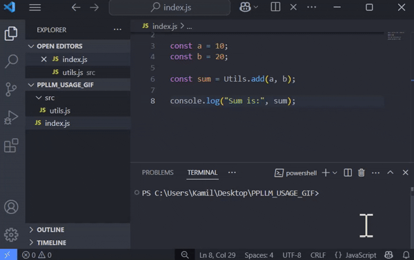
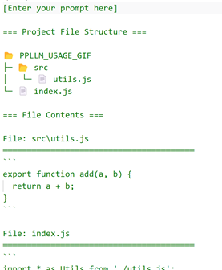

<table>
<tr>
<td>

</td>
<td>
<h2>ProjectPromptLLM</h1>
</td>
</tr>
</table>

  

Twój asystent do generowania promptów na podstawie struktury projektu! 🚀  
Prosto, wygodnie, konfigurowalnie — jedno polecenie wystarczy, by wygenerować czytelny prompt z drzewem plików i ich zawartością.

<table>
<tr>
<td>

</td>
</tr>
</table>

Aby zapisać wygenerowany prompt do pliku w bieżącym katalogu, uruchom:
```bash
ppllm
```

Prompt zapisany domyślnie w pliku `ppllm.prompt.txt` będzie wyglądał następująco:<br />
<table>
<tr>
<td>

</td>
</tr>
</table>


## 🌟 Czym jest PPLLM?

**ProjectPromptLLM** (`ppllm`) to narzędzie CLI, które tworzy prompt na podstawie struktury i zawartości plików projektu. Można go użyć w ChatGPT lub innym LLM. Zawiera predefiniowane zbiory ignorowanych plików, konfigurację i szablony.

## 💾 Instalacja

Zalecana instalacja globalna (w celu używania bez pośredniej komendy `npx`):
```bash
npm install -g ppllm
```
lub lokalnie (używaj `npx ppllm` w katalogu gdzie `ppllm` jest zainstalowany):
```bash
npm install ppllm
```

## 🚀 Podstawowe użycie

```bash
ppllm
```
Po uruchomieniu tej komendy bieżący katalog jest skanowany, a wygenerowany prompt zapisywany jest do pliku (domyślnie: `ppllm.prompt.txt`).

Może się zdarzyć, że w zawartości promptu znajdą się niechciane pliki, takie jak te z `node_modules`, które mogą być bardzo duże i sprawić, że prompt stanie się niepraktyczny. Aby tego uniknąć, uruchom tę komendę raz:

```bash
ppllm -p nodejs
```

W ten sposób poinstruujesz `ppllm`, aby używał wbudowanego presetu z ścieżkami do ignorowania typowymi dla projektu `node.js`. Skrypt zapisze również tę decyzję w pliku konfiguracyjnym (domyślnie: `ppllm.config.json`) w bieżącej lokalizacji, dzięki czemu następnym razem możesz po prostu użyć `ppllm` bez dodatkowych parametrów.

## 🧠 Zaawansowane użycie

Kreator konfiguracji:
```bash
ppllm init
```

Lista presetów lub ich podgląd:
```bash
ppllm preset
ppllm preset python
```

Sprawdzenie wersji:
```bash
ppllm version
```

Pomoc:
```bash
ppllm --help
ppllm preset --help
ppllm generate --help
```

## 🛠️ Konfiguracja

Ustawienia zapisywane są w lokalnym pliku (domyślnie: `ppllm.config.json`).

CLI automatycznie zapisuje ustawienia po użyciu interaktywnego kreatora (`ppllm init`) lub podczas generowania promptu z określonymi opcjami, np.: `ppllm -p nodejs -b all`.  
W pliku konfiguracyjnym znajdziesz również miejsce na własną listę ignorowanych plików i folderów `"ignore"` (w formacie `glob`), która zostanie połączona z wybranym presetem.

Przykładowa zawartość pliku konfiguracyjnego:
```json
{
  "settings": {
    "template": "pl",
    "file": "ppllm.prompt.txt",
    "preset": ["general", "nodejs"],
    "maxSize": "10KB",
    "binary": "tree",
    "emoji": true
  },
  "ignore": [
    "dist"
  ]
}
```

## 🧩 Szablony

Generowanie promptu odbywa się na podstawie szablonu Handlebars (`.hbs`). Domyślnie używany jest wbudowany angielski szablon `eng`, ale dostępne są również inne wbudowane szablony. Aby użyć własnego szablonu, najpierw sklonuj domyślny szablon za pomocą polecenia `init`.

Aby określić, który szablon ma być używany, możesz zaktualizować wartość w pliku konfiguracyjnym, ustawić ją podczas inicjalizacji lub skorzystać z opcji `--template`/`-t` podczas generowania promptu:

```bash
ppllm -t ppllm.prompt.hbs
```

Aby powrócić do jednego z domyślnych ustawień, uruchom jedną z poniższych komend:

```bash
ppllm -t eng
ppllm -t pl
```

## 🗂️ Presety

Presety to gotowe listy plików i folderów, które są pomijane podczas generowania promptu.  
Projekt zawiera wbudowane presety, ogólny oraz dla popularnych technologii:

- `general`
- `nodejs`
- `python`

Presety **nie mogą być rozszerzane przez użytkownika**, ale możesz dodać własne reguły ignorowania w pliku konfiguracyjnym.

## 📝 Inne funkcje

- Obsługa plików binarnych w trzech trybach: `tree`, `all`, `none`.
- Ograniczenie rozmiaru plików (`--max-size`) dla ładowania zawartości.
- Opcjonalne emoji w promptach 🎉.

## 🎯 Przykłady użycia

Generowanie promptu używając presetów `general` i `nodejs` oraz emoji:

```bash
ppllm -p general nodejs -e
```

Generowanie promptu do pliku z niestandardową nazwą:

```bash
ppllm -f magic.prompt.txt
```

## ⚙️ Opcje CLI

| Flaga                        | Opis                                       | Domyślna wartość |
| --------------------------- | ------------------------------------------ | ---------------- |
| `-d, --dir <dir>`            | Katalog źródłowy (relatywny do CWD)       | `.`              |
| `-t, --template <template>`  | Szablon Handlebars                        | `eng`            |
| `-f, --file <filename>`      | Nazwa pliku wynikowego                    | `ppllm.prompt.txt` |
| `-p, --preset <preset...>`   | Presety ignorowanych plików               | []               |
| `-m, --max-size <size>`      | Maks. rozmiar pliku (np. 10MB, 5KB)       | `disable`        |
| `-b, --binary <mode>`        | Tryb plików binarnych (`tree`, `all`, `none`) | `tree`      |
| `-e, --emoji`                | Emoji w promptach                         | `false`          |

## 🧭 Inne opcje CLI

| Flaga                        | Opis                                       | Domyślna wartość |
| --------------------------- | ------------------------------------------ | ---------------- |
| `-o, --output <mode>`        | Wyjście: `stdout` lub `file`               | `file`           |
| `-c, --config <filename>`    | Nazwa pliku konfiguracyjnego               | `ppllm.config.json` |

## ⚖️ Licencja

ISC © [tonylus](https://github.com/TonylusMark1)
